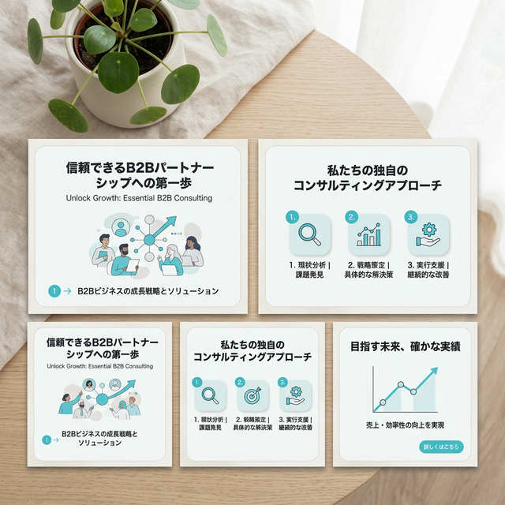

# machiスタジオ Instagram投稿 デザインシステム

Instagramでの視覚的な一貫性（ブランディング）を確立するため、カルーセル画像の基本ルールを定義します。

## 1. デザインコンセプト (Visual Identity)
**「経営者に寄り添う温かみと誠実さ（Warm & Trustworthy）」**
- 経営者が抱える孤独や悩みを優しく包み込み、「一緒に前を向こう」と思わせるような温かいトーン。
- アイコンにも使用されている「ターコイズブルー」を基調とし、重すぎず、さわやかで誠実な「外部CMO」としての信頼感を表現する。

## 2. カラーパレット (Colors)
- **ベースカラー (Base)**: `Soft White` (#FAFAFA) や `Snow` - 完全な純白ではなく、ほんの少しだけ温かみのある白（オフホワイト）に寄せることで、清潔感とさわやかさを出しつつ眩しさを抑える。
- **メインカラー (Main)**: `Turquoise Blue` (#00B5B5) - アカウントのアイコンに合わせたアクセントカラー。誠実さ、知性、そして未来への希望を感じさせる色。CTAの背景や強調線に使用。
- **テキストカラー (Text)**: `Dark Brown` (#3E312C) や `Charcoal Gray` - 真っ黒（#000000）はコントラストが強すぎて冷たくなるため、少し茶色がかったダークグレーやブラウンを採用して優しさを出す。

## 3. フォント・タイポグラフィ (Typography)
- **見出し・強調**: `Noto Sans JP` (Black または Bold) - スマホの小さい画面でも一瞬で目に飛び込む太いゴシック体。
- **本文・補足**: `Noto Serif JP` (明朝体) または `Noto Sans JP` (Medium) - 感情に訴えかけるスライド（ProblemやAgitation）では、明朝体を使うと「経営者の内なる声（悩み）」がよりエモーショナルに伝わります。

## 4. 全体レイアウトのルール
- **余白の確保**: 画面の上下左右に十分な余白（セーフエリア）を設ける。Instagramのエクスプローラー画面やプロフィールグリッドで上下が切れても、文字が切れないようにする。
- **視線の誘導**:
  - `左上` に小さく「#machiスタジオ」や通し番号（1/6）を配置。
  - `中央` にドンとキャッチコピー。
  - `右下` にスワイプを促す矢印（→）。

## 5. モックアップ画像（ターコイズ＆温かみ版）

文字主体のスライドの場合、温かみのあるオフィス風景などを背景に敷き、その上に少し白みがかった半透明のレイヤー（不透明度80%程度）を重ねてブラウンやグレー系の文字を配置すると、親しみやすくもプロフェッショナルな印象になります。

### テンプレート・レイアウト案（参考）

### 背景素材プレースホルダー（温かい共創空間）

